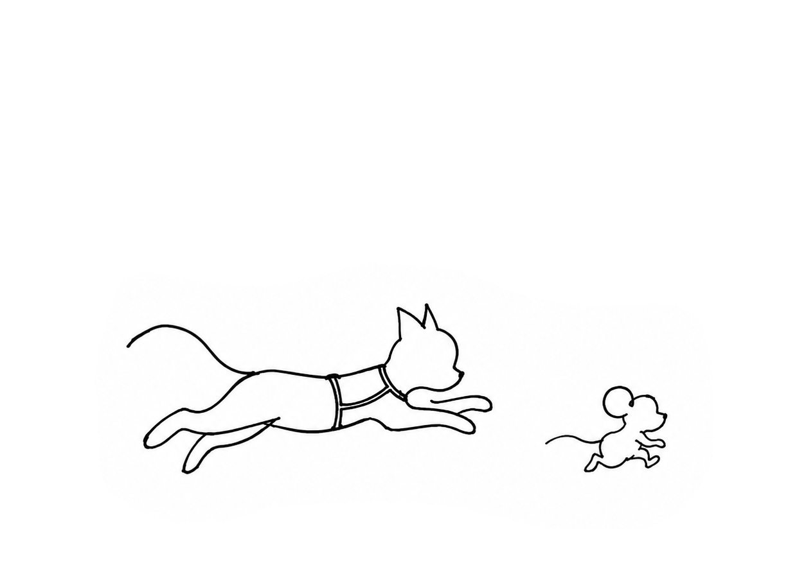

<p align="center">
  
</p>

<h1 align="center">Tom n Jerry</h1>

<p align="center">
  <i>Tom finds a solution. Jerry finds a shortcut.</i>
</p>

<p align="center">
  <a href="https://www.npmjs.com/package/@hrshx3o5o6/tomnjerry"></a>
  <a href="https://github.com/hrshx3o5o6/Tom-n-Jerry"></a>
  <a href="https://github.com/hrshx3o5o6/Tom-n-Jerry/actions"></a>
  <a href="https://github.com/hrshx3o5o6/Tom-n-Jerry/blob/main/LICENSE"></a>
  <a href="https://www.npmjs.com/package/@hrshx3o5o6/tomnjerry"></a>
</p>

**Tom n Jerry** is a portable, agent-agnostic **opportunity detection layer** for your AI coding agents (Claude Code, Cursor, Aider, opencode). 

It stops your agent from brute-forcing code abstractions and forces it to behave like a lazy, street-smart senior developer.

```bash
npx @hrshx3o5o6/tomnjerry init
```

---

## The Analogy

### 🐱 Tom: Momentum
Tom is your AI coding agent's default planning mode. He turns vague intent into candidate moves, decomposes work into small actions, and keeps the agent pointed at a receipt.

When you ask Tom to add a simple feature, he tends to:
* Design custom React state managers.
* Write bespoke timezone parsers.
* Add new, unverified npm dependencies.
* Create complex helper wrappers.

Tom is momentum — without him, nothing ships. But he needs a second opinion.

### 🐭 Jerry: The Street-Smart Mouse
Jerry is the intervention layer. He intercepts Tom's massive 300-line implementation plan, looks at the environment, and finds the cheap shortcut.

Jerry points to:
* The native browser API that already does it.
* The utility library already installed in your lockfile.
* The single-line database field already configured.
* The git commit that deleted this exact feature three weeks ago.

Jerry deletes Tom's work, writes one line, and runs a test to prove it works.

---

## How It Works: The Loop

```
[User Request] ─► 🐱 Tom plans 300 LOC ─► 🐭 Jerry intercepts ─► [One-Line Move] ─► 🧾 Receipt verifies
```

Whenever you ask your agent to build something, Jerry intercepts the plan and outputs an **Opportunity Card**:

* **Type:** `native`
* **Claim:** Tailwind already supports class-based dark mode.
* **Evidence:** `tailwind.config.js` exists and contains dark theme variables.
* **Move:** Delete the custom Context Provider. Use the existing classes.
* **Receipt:** `npm run build && verify-screenshot`

---

## ⚡ Quick Start: 10-Second Setup

Get Tom n Jerry running in your repository immediately.

### 1. Initialize inside your project root
```bash
npx @hrshx3o5o6/tomnjerry init
```
This copies the `skills/` library locally and deploys config files for **Cursor** (`.cursorrules`), **Claude Code** (`claudeproj.md`), and **opencode** (`opencode.json`).

### 2. Verify initialization
```bash
ls skills/    # Should show skill directories
```
If you see the skill directories, installation is complete.

### 3. Always-On Mode (Recommended)

Inject `always-on-rules.md` into your agent's system prompt for continuous opportunity detection:

**Claude Code:**
```bash
cat always-on-rules.md >> claudeproj.md  # merge into project instructions
```

**Cursor:**
The `always-on-rules.md` is appended to `.cursorrules` during init.

**opencode:**
Add to `AGENTS.md` or `opencode.json` project instructions.

### 4. Doctor check
```bash
npm run doctor
```

### 5. Invoke inside your Agent
Once initialized, trigger the coordinator loop by referencing it in your agent prompt:
* **Cursor / Claude Code / opencode:**
  > `/tomnjerry Add [your goal]`
* **Manual Prompt:**
  If your agent doesn't support local commands, paste the combined rules from `templates/tomnjerry-combined.rules` directly into your system prompt.

### Uninstall / Cleanup
```bash
rm -rf skills/ .cursorrules claudeproj.md opencode.json
```

---

## The Skills in the Box

Tom n Jerry comes pre-configured with specialized Jerry sub-skills:

* [**`tom-core`**](skills/tom-core/SKILL.md) — Momentum engine: decomposes goals, unsticks plans, drives toward receipts.
* [**`jerry-core`**](skills/jerry-core/SKILL.md) — Preflight opportunity scan: checks workspace, deps, framework, shell, git before building.
* [**`browser-jerry`**](skills/browser-jerry/SKILL.md) — Uses native Web APIs (`popover`, `dialog`) instead of adding heavy JS libraries.
* [**`dependency-jerry`**](skills/dependency-jerry/SKILL.md) — Scans lockfiles to reuse packages instead of running new installs.
* [**`framework-jerry`**](skills/framework-jerry/SKILL.md) — Leverages framework-native features (Next.js middleware, Spring Boot config, etc.).
* [**`db-jerry`**](skills/db-jerry/SKILL.md) — Checks active database schemas to prevent duplicate fields and tables.
* [**`api-jerry`**](skills/api-jerry/SKILL.md) — Reuses route serializers instead of bloating endpoints.
* [**`delete-jerry`**](skills/delete-jerry/SKILL.md) — Solves bugs by deleting zombie code instead of writing patches.
* [**`unix-jerry`**](skills/unix-jerry/SKILL.md) — Uses a single shell command instead of custom Node/Python scripts.
* [**`git-jerry`**](skills/git-jerry/SKILL.md) — Restores previously deleted features from commit logs instead of rebuilding.
* [**`test-jerry`**](skills/test-jerry/SKILL.md) — Reuses existing test factories, fixtures, and infrastructure.
* [**`trap-jerry`**](skills/trap-jerry/SKILL.md) — Identifies complex traps (custom auth, caches) and redirects to standard libraries.
* [**`tomnjerry`**](skills/tomnjerry/SKILL.md) — Master coordinator that orchestrates the full loop (Tom → Jerry → Receipt).

---

## Contributing

Add a new Jerry skill only when it represents a distinct, street-smart behavioral shortcut. See [`CONTRIBUTING.md`](CONTRIBUTING.md).

---

## License

[MIT](LICENSE)
