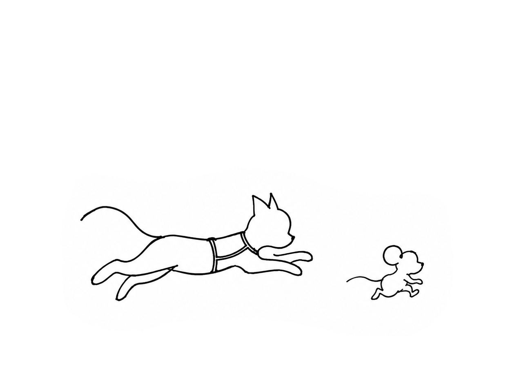

<p align="center">
  
</p>

<h1 align="center">Tom n Jerry</h1>

<p align="center">
  <i>Tom keeps moving. Jerry finds the shortcut.<br>The loop runs until it's done right.</i>
</p>

<p align="center">
  <a href="https://www.npmjs.com/package/@hrshx3o5o6/tomnjerry"></a>
  <a href="https://github.com/hrshx3o5o6/Tom-n-Jerry"></a>
  <a href="https://github.com/hrshx3o5o6/Tom-n-Jerry/actions"></a>
  <a href="https://github.com/hrshx3o5o6/Tom-n-Jerry/blob/main/LICENSE"></a>
</p>

**Tom n Jerry** stops your AI coding agent from overbuilding. It runs on every turn — intercepting unnecessary packages, finding existing code, and learning your codebase's patterns over time.

Unlike a static ruleset, it gets smarter. After three sessions of "add rate limiting to auth routes," Jerry knows your Express setup and skips the research entirely.

---

## The Problem

Your AI coding agent is capable. It's also an overbuilder.

You ask for a login endpoint. It installs `passport-jwt`, writes a custom middleware, creates a token verification utility, adds a session store — 400 lines of code. Your `package.json` already had `bcryptjs` and `jsonwebtoken`.

This happens every session. On every task. The agent doesn't know what your codebase already has.

---

## The Solution

Tom n Jerry runs a loop on every turn:

```
Tom → Jerry → (card or implement) → Receipt → Teacher → loop
```

**Tom** is momentum. He decomposes vague requests into concrete actions and states a receipt before writing anything.

**Jerry** is street smart. He checks your lockfile, your git history, your framework config, your native APIs — and finds the existing path.

**Receipt** is proof. After every change, Jerry runs a verification command and shows the output. No "it built."

**Teacher** is memory. After the session, if a non-obvious pattern was discovered, Jerry writes a skill file for next time.

---

## Before / After

**You:** "Add rate limiting to `/api/auth/*` routes"

**Without Tom n Jerry:**
Agent installs `express-rate-limit`, writes 80 lines of middleware config, adds Redis session store.

**With Tom n Jerry:**
Jerry reads `.tnj/index.json` → matches `dependency-jerry` → checks `package.json`
→ `express-rate-limit` already installed → `framework-jerry` → `next.config.js` has rate limit config already.

Jerry emits an Opportunity Card:

> **Type:** reuse
> **Claim:** `express-rate-limit` already in package.json.
> **Evidence:** `package.json#L23`
> **Move:** Use existing package, add 3 lines to route file.
> **Receipt:** `curl -I /api/auth/login`

**Result:** 3 lines of code. Zero new packages.

---

## The Loop, Explained

```
[User Request]
      │
      ▼
┌─────────────┐
│   TOM        │  Proposes one concrete action.
│  (Momentum)  │  "I'll add rate limiting to /api/auth/*"
│              │  States the receipt: "curl -I proves it works."
└──────┬──────┘
       │
       ▼
┌─────────────┐
│   JERRY     │  Reads .tnj/index.json, matches skills,
│(Street Smart)│  runs checks on package.json, git history,
│             │  native APIs, framework config.
└──────┬──────┘
       │
       ├─ Shortcut found ──► Opportunity Card ──► Tom implements
       │
       └─ No shortcut ──► Tom implements directly
                               │
                               ▼
                    ┌─────────────────┐
                    │    RECEIPT     │
                    │   (Proof)      │
                    │ curl -I ...    │
                    │ HTTP 429 OK    │
                    └────────┬────────┘
                             │
                             ▼
                    ┌─────────────────┐
                    │   TEACHER       │
                    │  (Learning)     │
                    │ Pattern worth   │
                    │ remembering?    │
                    │ Write .tnj/    │
                    │ learnings/     │
                    └────────┬────────┘
                             │
                             ▼
                       Next action
```

### The Ladder (What Jerry Checks)

Jerry runs this ladder on every turn, top to bottom:

1. **Does this need to exist?** → YAGNI. Skip it.
2. **Already in git history?** → `git log --grep` — was it deleted before?
3. **Already in codebase?** → `rg` search for existing functions.
4. **Already in package.json?** → Use the lockfile dep. Don't install.
5. **Stdlib covers it?** → Node `crypto`, Python `datetime`. No install.
6. **Native platform?** → Browser `<dialog>`, `popover`. No JS library.
7. **Framework convention?** → Next.js middleware, Spring auto-config. Use it.
8. **Then — build the minimum.**

### Self-Learning

After a session where Jerry discovered "express-rate-limit already installed," Teacher writes:

```markdown
# express-rate-limit-pattern

Trigger: before adding rate limiting to Express routes.

## Checks
1. package.json → express-rate-limit present?
2. Existing middleware in /api/auth already wired?

## Action
- If present: 3 lines to wire it.
- If not: install with --save-prod, wire 5 lines.

## Pattern
Already implemented at /api/auth/login — reuse for all /api/auth/* routes.
```

Next session: Jerry reads the skill in 2 seconds, Tom implements in minutes, not 30.

---

## Quick Start

```bash
# 1. Install globally (one time)
npm install -g @hrshx3o5o6/tomnjerry

# 2. Install the loop protocol into opencode (one time per machine)
tomnjerry install-global

# 3. Initialize in your project (one time per project)
cd /path/to/your/project
tomnjerry init

# 4. Restart opencode — the loop fires every turn
opencode
```

That's it. No config files. No package.json changes.

---

## What Gets Installed

```
.tnj/                # In your project
├── index.json         # Skill catalog (Jerry reads this first)
├── skills/           # 13 pre-built skill files
│   ├── dependency-jerry.md
│   ├── browser-jerry.md
│   ├── framework-jerry.md
│   ├── git-jerry.md
│   ├── delete-jerry.md
│   ├── trap-jerry.md
│   ├── api-jerry.md
│   ├── db-jerry.md
│   ├── unix-jerry.md
│   ├── test-jerry.md
│   ├── jerry-core.md
│   ├── tom-core.md
│   └── receipt-jerry.md
└── learnings/        # Your custom skills accumulate here
```

---

## Benchmarks

Tom n Jerry's value is only visible in **multi-turn agentic sessions** — where the loop fires on every step across a real coding task. Single-shot benchmarks (one prompt → one response) measure none of this.

**Multi-turn agentic benchmarks are in progress.** We're building a reproducible benchmark suite that measures:
- Rate of unnecessary package installs across a 10-task feature development session
- Lines of code written vs. necessary minimum
- Time saved on repeated patterns

Follow [`benchmarks/agentic/`](benchmarks/agentic/) for methodology and results as they publish.

---

## Tom n Jerry vs. Other Approaches

| | Overbuilding Prevention | Self-Improving | Per-Project Learning | Verified Receipts |
|--|:--:|:--:|:--:|:--:|
| **Tom n Jerry** | ✔ | ✔ | ✔ | ✔ |
| Ponytail | ✔ | ✗ | ✗ | ✗ |
| Caveman | ✗ | ✗ | ✗ | ✗ |
| Raw agent | ✗ | ✗ | ✗ | ✗ |

Ponytail stops overbuilding in the moment. Tom n Jerry also remembers what it found — so the second time you do the same task, Jerry doesn't even have to look.

---

## The Characters

**Tom** — Momentum. Every turn, Tom proposes the next concrete action. He breaks vague requests into 3-5 verifiable steps. He states the receipt before writing code. Without Tom, the agent stalls. With Tom alone, the agent overbuilds.

**Jerry** — Street smarts. Before every action, Jerry reads the skill index, loads relevant skills, and runs checks. He finds the shortcut. He deletes zombie code. He runs the receipt. He writes what he learned back to `.tnj/learnings/` for next time.

**Teacher** — After every session, Teacher reviews what was discovered. Patterns that repeat get promoted to skills. Skills that go unused get archived. The system gets faster over time.

---

## Uninstall

```bash
# Remove from a project
rm -rf .tnj/

# Remove globally from opencode
tomnjerry remove-global

# Uninstall the npm package
npm uninstall -g @hrshx3o5o6/tomnjerry
```

---

## Contributing

See [CONTRIBUTING.md](CONTRIBUTING.md) for setup, testing, and PR guidelines.

---

## License

[MIT](LICENSE)
